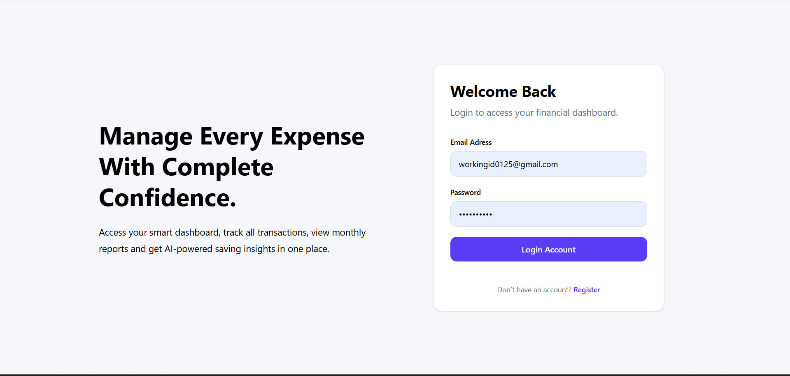
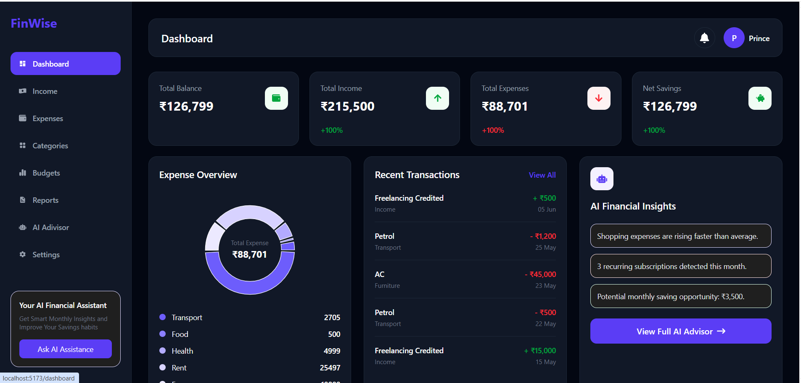
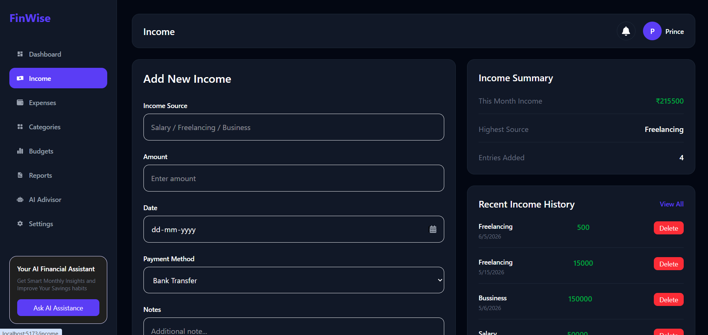
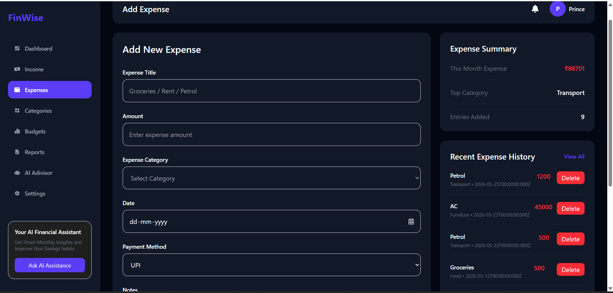
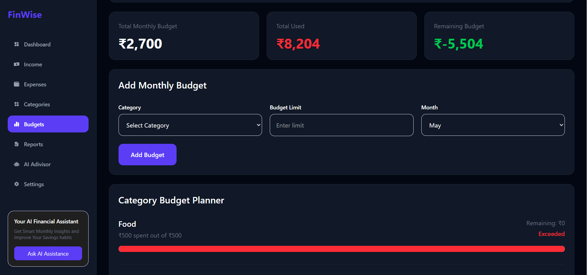
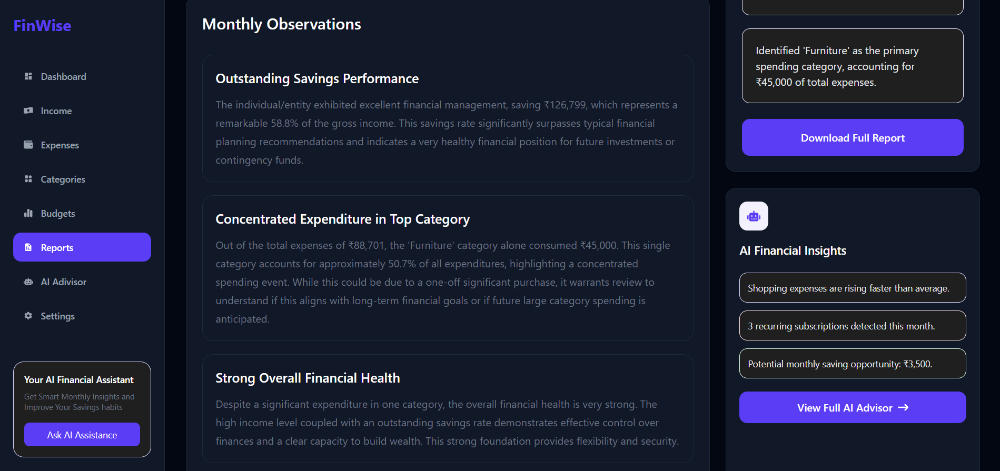
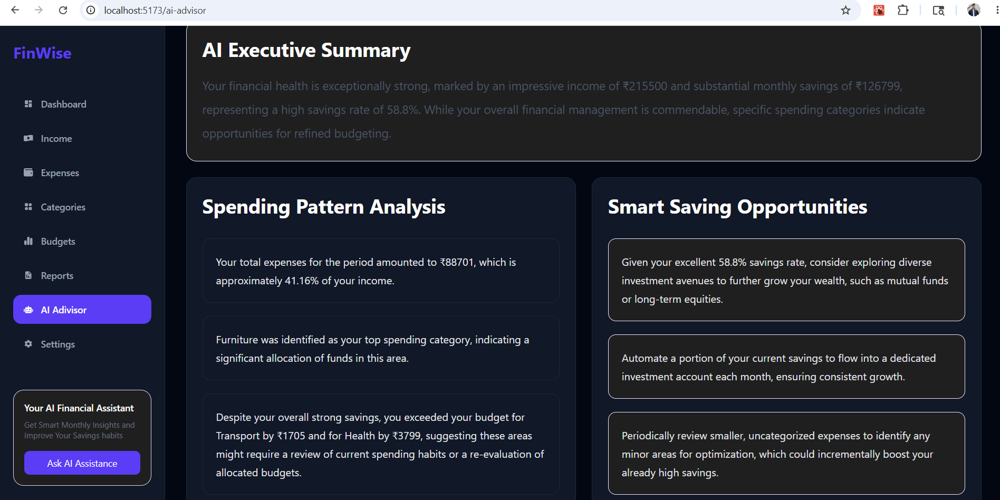
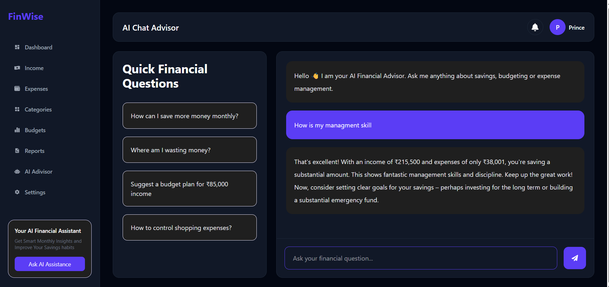
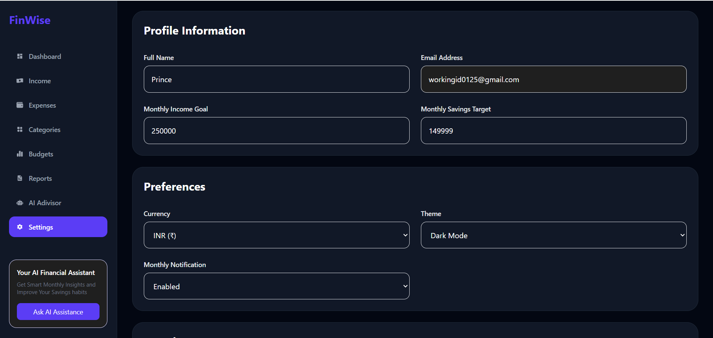

# FinWise AI

AI-Powered Personal Finance Management Platform

FinWise AI is a full-stack personal finance management application that enables users to track income, manage expenses, create budgets, analyze spending patterns, and receive AI-generated financial insights. The platform combines financial analytics with conversational AI to help users make informed financial decisions.

---

## Live Demo

Frontend: (https://finewise-ai.vercel.app)

Backend API: https://finewise-ai.onrender.com
---

## Overview

FinWise AI provides a centralized dashboard for managing personal finances. Users can monitor their financial activity, set budget limits, visualize spending trends, and interact with an AI assistant that offers personalized recommendations based on their financial data.

---

## Features

### Authentication & Security

* User Registration and Login
* JWT Authentication
* Protected Routes
* Password Management
* Secure API Access

### Financial Management

* Add, Edit, and Delete Income Records
* Add, Edit, and Delete Expense Records
* Real-Time Balance Calculation
* Transaction History Tracking
* Category-Based Expense Organization

### Categories

* Create Custom Categories
* Edit Categories
* Delete Categories
* Icon-Based Category Support

### Budget Management

* Monthly Budget Planning
* Category-Wise Budget Limits
* Budget Utilization Tracking
* Overspending Detection
* Remaining Budget Monitoring

### Dashboard Analytics

* Income Overview
* Expense Overview
* Savings Calculation
* Expense Distribution Charts
* Recent Transactions
* Category-Based Analytics

### Reports

* Monthly Financial Summary
* Savings Analysis
* Spending Insights
* Category-Wise Breakdown
* AI-Generated Financial Observations

### AI Advisor

* Spending Analysis
* Savings Recommendations
* Budget Evaluation
* Financial Health Assessment

### AI Financial Chat

* Interactive Financial Assistant
* Personalized Financial Guidance
* Budgeting Advice
* Spending Optimization Suggestions

### User Preferences

* Dark Mode Support
* Savings Goals
* Income Targets
* Currency Preferences
* Notification Settings

---

## Screenshots

### Login Page



### Dashboard



### Income Management



### Expense Management



### Budget Planner



### Reports



### AI Advisor



### AI Financial Chat



### Settings



---

## Technology Stack

### Frontend

* React.js
* Vite
* Tailwind CSS
* Recharts
* React Router DOM
* Axios
* React Icons

### Backend

* Node.js
* Express.js
* MongoDB
* Mongoose
* JWT Authentication
* bcrypt.js

### AI Integration

* Google Gemini API

### Deployment

* Frontend: Vercel
* Backend: Render
* Database: MongoDB Atlas

---

## Architecture

```text
Frontend (React + Vite)
          │
          ▼
Backend (Node.js + Express)
          │
          ▼
MongoDB Atlas
          │
          ▼
Google Gemini API
```

---

## Project Structure

```text
FineWise-AI
│
├── Frontend
│   ├── src
│   │   ├── Components
│   │   ├── Pages
│   │   ├── Context
│   │   ├── Routes
│   │   ├── Utils
│   │   └── api
│
├── Backend
│   ├── Controllers
│   ├── Models
│   ├── Routes
│   ├── Middleware
│   ├── Services
│   ├── Config
│   └── server.js
│
└── README.md
```

---

## Installation

### Clone Repository

```bash
git clone https://github.com/yourusername/FinWise-AI.git

cd FinWise-AI
```

### Backend Setup

```bash
cd Backend

npm install
```

Create a `.env` file:

```env
PORT=5000

MONGO_URL=your_mongodb_connection_string

JWT_SECRET=your_jwt_secret

GEMINI_API_KEY=your_gemini_api_key
```

Start Backend:

```bash
npm run dev
```

### Frontend Setup

```bash
cd Frontend

npm install
```

Create a `.env` file:

```env
VITE_API_URL=http://localhost:5000/api
```

Start Frontend:

```bash
npm run dev
```

---

## Environment Variables

### Backend

```env
PORT=
MONGO_URL=
JWT_SECRET=
GEMINI_API_KEY=
```

### Frontend

```env
VITE_API_URL=
```

---

## Future Enhancements

* PDF Report Export
* Email Financial Reports
* Receipt OCR Scanner
* Recurring Transactions
* Voice-Based Financial Assistant
* Predictive Expense Forecasting
* AI Budget Forecasting
* Multi-Currency Support

---

## Author

Prince Raj

B.Tech, IIT Kharagpur

---

## License

This project is intended for educational and portfolio purposes.

---

## Support

If you found this project useful, consider giving it a star on GitHub.
